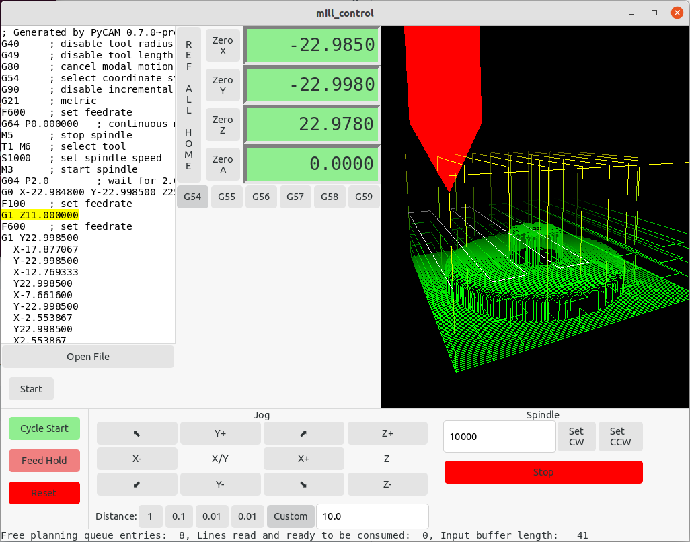

# mill_control - a simple tool to control a TinyG cnc controller

This creates a single binary that is able to directly control a TinyG board.
* You can manually jog or run a gcode file.
* Feed hold works, cycle start continues the program. Reset does reset the TinyG.
* There is a 3D display of the gcode which is continuously updated while the program runs.
* There is support for a WHB04B remote.
* The spindle motor can be controlled while jogging.



## Getting Started

mill_control is written in Rust. Binary releases are currently not available. Building on Windows does currently not work.

### Prerequisites

You need a Rust/Cargo installation. See https://rustup.rs/.
You will need some additional packages. On debian/ubuntu you could run
```
sudo apt-get install -y libudev-dev libusb-1.0-0-dev libhidapi-libusb0 libpango1.0-dev libgtk-4-dev
```
After checking out this repository you can simply run

```
cargo run
```

and if that works you can install the binary.


### Installing

You can build a binary for deployment by running

```
cargo build --release
```


## Authors

See the list of [contributors](https://github.com/dr0ps/mill_control/contributors) who participated in this project.

## License

This project is licensed under the GNU GENERAL PUBLIC LICENSE, Version 2 - see the [LICENSE](LICENSE) file for details

